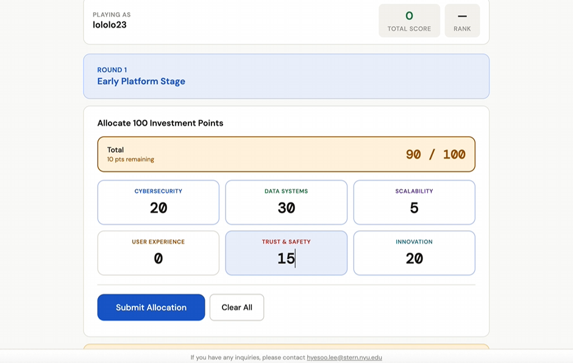

# Platform IT Risk Investment Game

## Overview

The **Platform IT Risk Investment Game** is an interactive classroom activity designed to help students practice making investment decisions to manage IT risks on a digital platform.

Students allocate limited resources based on the platform’s maturity level. After they submit their investment decisions, specific IT risks are revealed. Students then earn points based on how effectively their investments address those risks.

Through this activity, students can better understand the relationship between:

* Platform maturity
* IT risk management
* Resource allocation
* Strategic investment decisions

## Play the Game

🌐 **[Launch the game](https://rococo-haupia-a8742b.netlify.app)**

## How It Works

1. Review the platform’s current maturity level.
2. Allocate the available resources across different IT investment areas.
3. Submit your investment decisions.
4. Observe the IT risks revealed during the round.
5. Earn points based on how effectively your investments mitigate those risks.
6. Compare your performance with other participants.

## Game Demonstration

▶️ Click the image below to watch the game demonstration.

## Instructional Slides

📑 **[View the instructional slides](https://drive.google.com/file/d/16DbX_bzLvTaiKR8yewwhwdmY2XYBzWcg/view?usp=sharing)**

The slides provide instructions for introducing the activity, explaining the investment decisions, and facilitating the game in class.

## Instructor Access

An instructor password is required to access the instructor features.

For the instructor password, please contact:

📧 [hyesoo.lee@stern.nyu.edu](mailto:hyesoo.lee@stern.nyu.edu)

## Intended Learning Objective

This activity is intended to help students understand how a platform’s maturity level affects its IT risk exposure and how organizations can strategically allocate limited resources to manage those risks.
